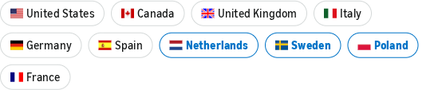

# Affiliate monetization repairs — October 2, 2026

## Published and verified

All production changes used connected GitHub → Cloudflare Workers Builds. No direct publishing was used.

| Site | Repair | Production verification |
|---|---|---|
| Amputee News | Explicit code approval and literal `amputeenews-20`; 40 real product pages reviewed, one unavailable prosthetic sock archived; 39 products activated. Stale prices/ratings and related sorting removed. Active disclosures and no outbound prefetch. | Live Gear returns 200 with 39 unique tagged Amazon product destinations. Build `c6b17ef8-2076-46be-b9de-1fe6ae7871d6` succeeded, commit `c29e16d`. |
| Black Market Apparel | Six untracked Anthropologie/Shinola/Zappos/Shopbop destinations replaced with six reviewed, in-stock Amazon alternatives. Central builder pins `blackmarketapparel-20`. Updated names/material claims and style-image disclosure. Unknown products return 404; valid redirects are 302 with no-store/noindex. | All six live product routes return the reviewed ASIN and exact tag; unknown-product probe returns 404. Build `899d9e6a-42a8-41a4-b799-5bc19e001c12` succeeded, commit `b91e210`. |
| Saltwater News | Five search redirects tagged `saltwaternews-20`; missing/duplicate/wrong-tag build guard and active disclosure. | All five live bare routes rechecked: 302 with exact tag. Connected build `9585963d-0005-4cc4-aea2-25c90ecd1baa` succeeded, commit `c55a15f`. |
| Rodhat | Ten affiliate signup placeholders replaced with real vendor product destinations and explicitly marked unpaid. Public disclosure corrected. Amazon tag pinned literally to `rodhat-20`. | All 27 live interstitials checked: 17 tagged Amazon routes and 10 unpaid vendor routes. Build `dc969eaf-1290-4610-a8d9-25a041881196` succeeded, commit `2896bae`. |

Amputee News and Black Market Apparel now run affiliate guards as part of every `npm run build`, including the connected production build. These check reviewed catalog coverage, exact tags and required disclosures. Amputee's guard also rejects rendered pending-state copy, missing product links and missing sponsored attributes. Required production dependency audits and local builds passed; dependency patch fixes were applied where those gates originally failed. Amputee's image check and Rodhat's source/built-SEO checks passed.

Rodhat’s ten partners **do not yet earn commissions**. Approved owner-supplied referral links/accounts are still needed. Replacing signup pages with accurate product pages fixes the reader destination and disclosure; it does not invent partner attribution.

## Broader source scan

61 checked-out site source roots were inspected for affiliate registries and static Amazon redirect tags. All 2,266 static Amazon redirect rules carry exactly one tag, and every tag belongs to the account’s 35 registered tracking IDs. No other approval environment switch like Amputee's remains inactive in the inspected Amazon helpers. Non-Amazon catalog URLs found by the registry parser were Rodhat's ten unpaid partners. HowToFry remains explicitly active with the full `howtofry.com-20` tag.

This combines current source inspection with the earlier live attribution audit. It is not an exhaustive stock check of thousands of products. Intentionally unpublished/preview sites were not launched as part of this repair; Weapon Tester’s public preview gate still limits shopper validation. Search-only helpers may correctly parse as zero ASINs; that is not evidence that affiliate earning is disabled.

## International correction and account evidence

The earlier assessment relied too heavily on legacy OneLink pages and is corrected. The legacy redirection-preferences URL now redirects to [Amazon's Global Earning announcement](https://www.amazon.com/b?node=216882793011). It says US creators are enrolled automatically and existing affiliate links work across US, Canada, UK, Germany, France, Italy, Spain, Netherlands, Poland and Sweden. Missing legacy store mappings do **not** establish missing international earning in those countries. Legacy OneLink remains relevant for countries outside that launch group.

Authenticated account checks found:

- United States tax status: **Completed**.
- Canada tax status: **Completed**.
- Existing bank account assigned to **Netherlands, Sweden and Poland**.
- Existing US payment method: **Amazon Gift Card**.
- **Six countries have no payment method assigned:** Canada, United Kingdom, Germany, France, Italy and Spain.
- Amazon's “Add to [existing bank account]” confirmation explicitly says **6 countries will be assigned**. No bank details need to be replaced.
- The country opt-out preference screen was not independently exposed by the inspected account UI. No claim is made that its toggles were verified or changed.

The payout assignment gap is separate from affiliate link attribution/enrollment. No financial settings were changed. Owner approval was requested to assign those six unassigned countries to the existing bank account while preserving US gift-card payment. The confirmation is open in the visible CloakBrowser window, awaiting the owner's reply.

[Open Amazon payment settings](https://affiliate-program.amazon.com/home/account/paymentMethods).

The screenshot below is cropped to country assignments only; blue means assigned to the existing bank account. US is not blue because it uses a different payment method. This screenshot is not a country-enrollment or opt-out screen.

Sanitized evidence: `amazon-affiliate-repairs-2026-10-02.json`. No bank numbers, routing numbers, tax-interview URLs, credentials or session cookies are included. Repairs establish working attribution, not a guaranteed conversion uplift.

## Subsequent owner instruction: Amazon only

The owner clarified that Rodhat must use Amazon exclusively. Commit `ec9fe2d` removes the ten vendor entries, updates five affected articles with accurately described Amazon book recommendations, adds `/books-and-gear/` with 18 tagged commercial entries, and retires old vendor routes with a clear notice. Approved non-Amazon partner links are no longer requested or needed. Every build enforces the Amazon-only commercial policy. See `sites/rodhat.com/ops/reports/2026-10-02-amazon-only-commercial-links.md` for implementation and existing dependency-audit limitations.

Connected Cloudflare build `bfaa23e7-9fc8-4b39-beb9-33497c57f553` succeeded for `ec9fe2d`. Production checks passed for all 18 Amazon commercial routes, all ten retirement notices, and the new shopping shelf. International payout settings remain unchanged; the six-country assignment confirmation is still open in CloakBrowser.
